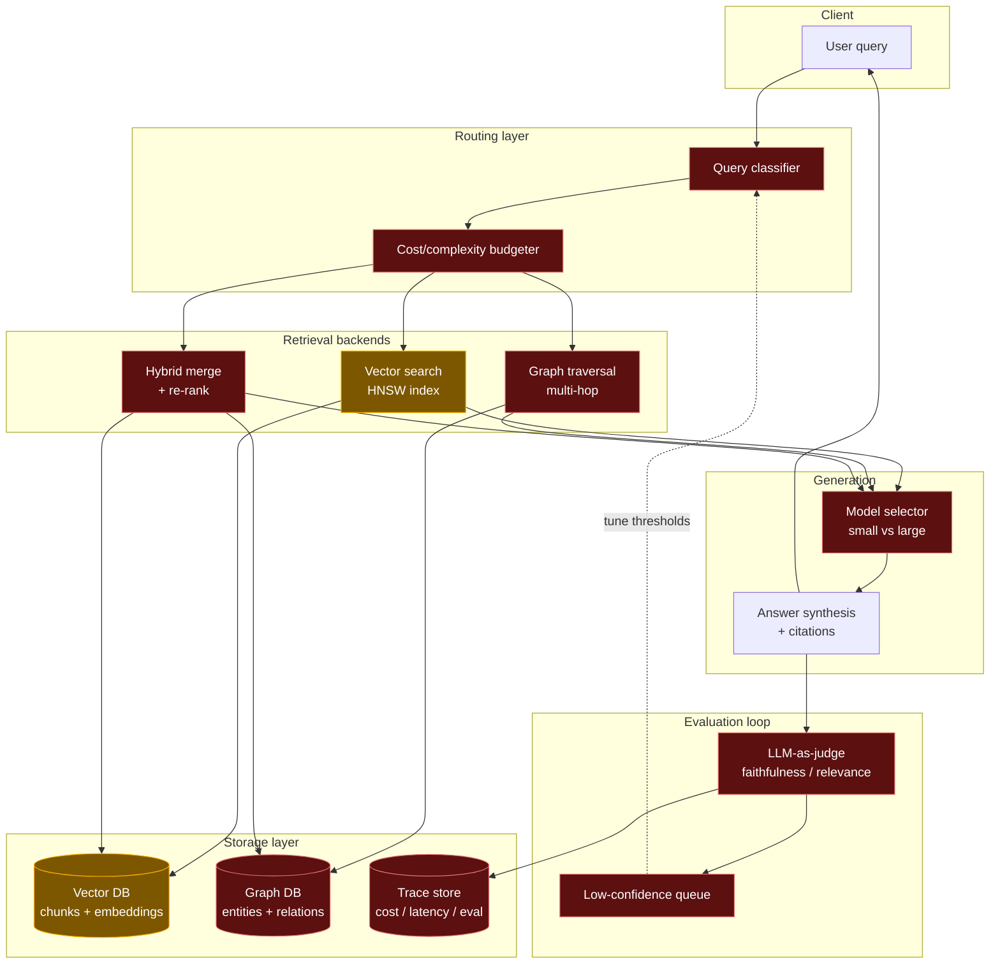
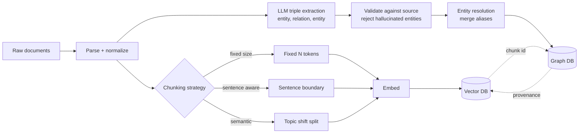
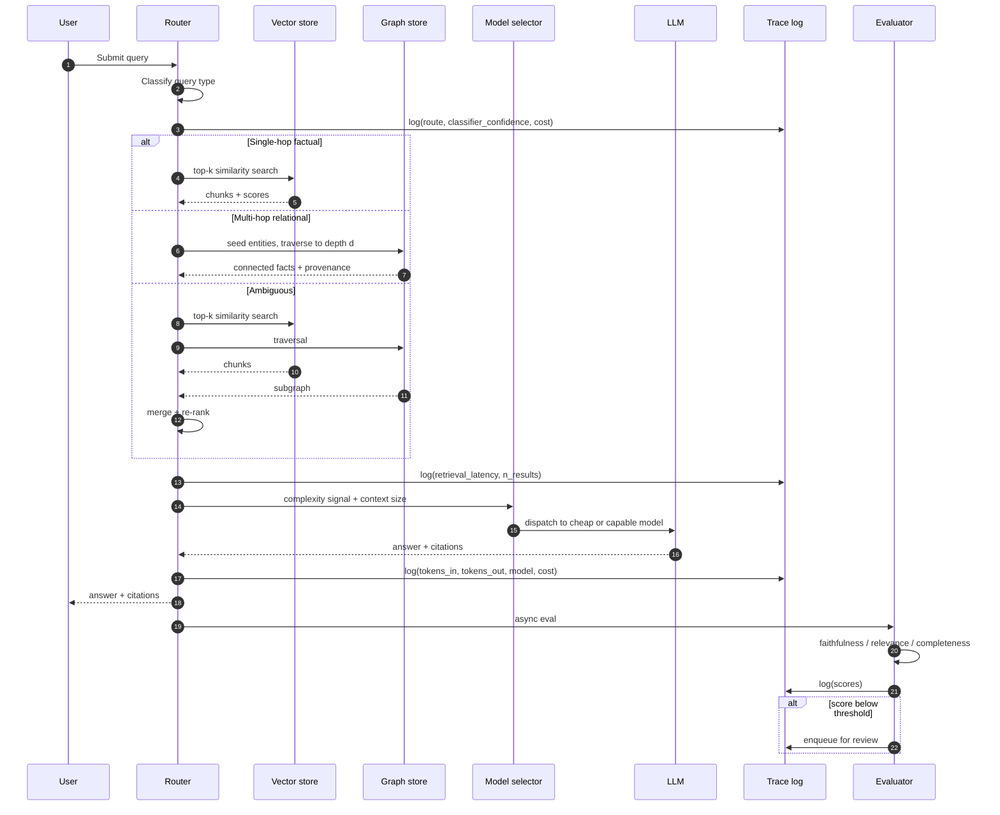
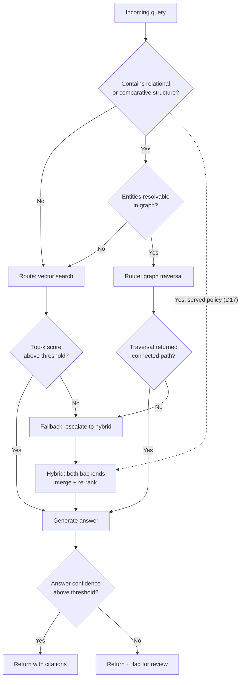
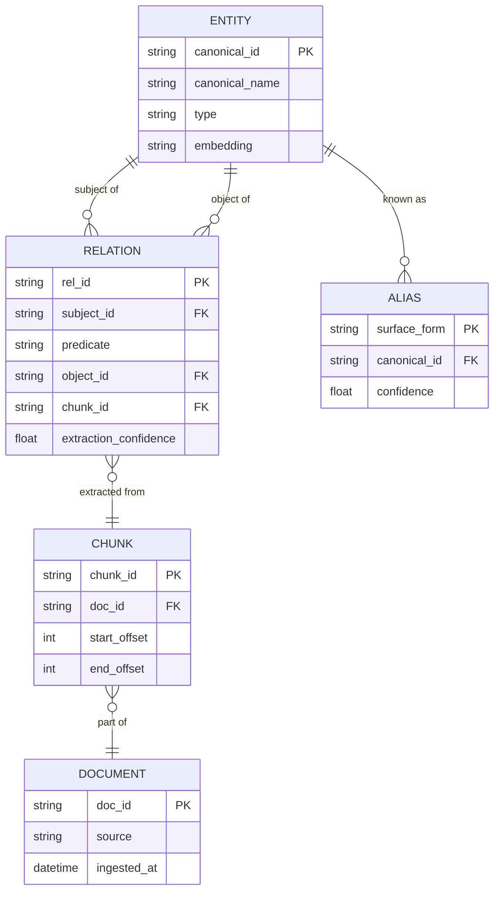
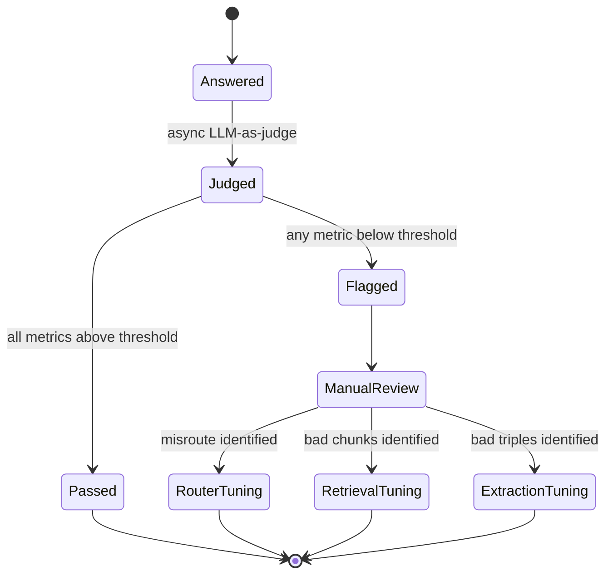
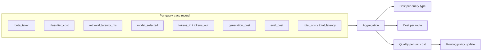
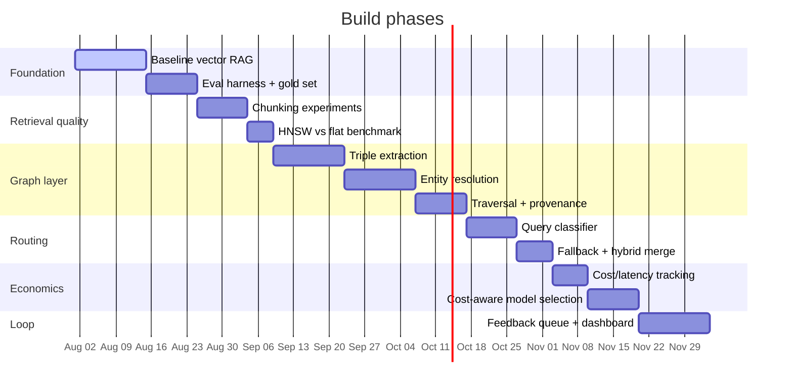

# Adaptive RAG + GraphRAG + Cost-Aware Agent Router 

> ACTIVE DEVELOPMENT 
> : This project is being built in phases. 

---

## Table of Contents

- [What this is](#what-this-is)
- [Why it exists](#why-it-exists)
- [Results](#results)
- [System architecture](#system-architecture)
- [Ingestion pipeline](#ingestion-pipeline)
- [Query lifecycle](#query-lifecycle)
- [Router decision logic](#router-decision-logic)
- [Graph schema](#graph-schema)
- [Evaluation feedback loop](#evaluation-feedback-loop)
- [Cost & latency accounting](#cost--latency-accounting)
- [Design decisions & tradeoffs](#design-decisions--tradeoffs)
- [Known failure modes](#known-failure-modes)
- [Roadmap](#roadmap)
- [Repo layout](#repo-layout)
- [Getting started](#getting-started)
- [Honest scope statement](#honest-scope-statement)

---

## What this is

A question answering system that **routes queries between two retrieval strategies** — dense vector similarity search and graph-based multi-hop traversal — based on the structure of the question being asked. Every routing decision is instrumented for cost and latency, and an evaluation loop logs low-confidence answers so retrieval choices can be tuned against measured quality rather than intuition.

The core retrieval, routing, and agent logic are written **from scratch** rather than assembled from a framework, so that the failure modes are visible at the implementation level instead of hidden behind an API surface.

## Why it exists

Standard RAG — embed, retrieve top-k, stuff into prompt — fails quietly in two ways:

1. **Multi-hop questions break it.** "What company did the person who founded X later work for?" needs two facts that live in different chunks. The second fact may have near-zero semantic similarity to the original query, so similarity search never surfaces it. The answer comes back confident and wrong.
2. **There is no visibility.** No per-query cost, no latency attribution, no signal on whether retrieval was the weak link or generation was.

This project addresses both: a graph layer for relational/multi-hop questions, a router to pick between strategies, and instrumentation on every decision.


## Results

Every number below comes from a pinned run listed in [`docs/results/pinned.toml`](docs/results/pinned.toml); each
run's report sits next to it in `docs/results/`. Corpus: 2,957 HotpotQA documents (4,277 sentence chunks), see [the dataset](docs/dataset.md). Models
run locally through Ollama: `gpt-oss:20b` answers as the small model, `qwen3.6:35b-a3b` as the large one, and
`gemma4:31b` judges (a different family). Costs are the public list price of the same weights.

### Held out test split (50 questions, each mode run once)

| Route | EM | F1 | Recall@8 | Faithfulness | Cost / query | p50 | p95 | Run |
|---|---|---|---|---|---|---|---|---|
| **auto (served)** | **0.720** | **0.811** | 0.970 | 0.935 | $0.00105 | 9.5 s | 14.9 s | `20260930-1557-test-auto-baseline` |
| hybrid | 0.640 | 0.728 | 0.970 | 0.935 | $0.000027 | 2.8 s | 6.1 s | `20260930-1534-test-hybrid-baseline` |
| vector | 0.640 | 0.725 | 0.980 | 0.955 | $0.000024 | 1.2 s | 1.7 s | `20260930-1453-test-vector-baseline` |
| graph | 0.540 | 0.622 | 0.770 | 0.915 | $0.000021 | 2.1 s | 2.6 s | `20260930-1516-test-graph-baseline` |

F1 by question type (single hop / multi hop / comparison): auto 0.874 / **0.744** / 0.831, hybrid 0.874 / 0.538 /
0.831, vector 0.882 / 0.539 / 0.805, graph 0.874 / 0.329 / 0.744. The adaptive system wins on multi hop questions,
and the gain comes from sending the relational questions through hybrid retrieval to the large model
([D17](docs/decisions.md), [D20](docs/decisions.md)); graph traversal on its own is the weakest route. Latency was
measured on a server with two RTX 5090s against Neon in Singapore; auto is slower and dearer because 34 of its 50
questions go to the large model.

### Choosing the model per question (dev split, 100 questions)

| Variant | F1 | Faithfulness | Cost / query | Large model share | Run |
|---|---|---|---|---|---|
| always small | 0.821 | 0.945 | $0.000027 | 0% | `20260930-1346-dev-auto-always-small` |
| **selector (served)** | **0.848** | 0.975 | $0.000831 | 56% | `20260930-1346-dev-auto-selector` |
| always large | 0.859 | 0.990 | $0.001386 | 100% | `20260930-1248-dev-auto-always-large` |

The selector keeps most of the large model's gain at 60% of its cost. The quality per unit cost table also holds
the forced routes on dev with the small model: vector F1 0.776 (faithfulness 0.935, `20260930-1248-dev-vector-baseline`),
hybrid 0.821 (0.945, `20260930-1248-dev-hybrid-baseline`) and graph 0.498 (0.943, `20260930-1248-dev-graph-baseline`). Full economics (cost and latency per type and
per route, quality per unit cost): [`econ-20260930-2158-dev`](docs/results/econ-20260930-2158-dev.md).

### Router, graph and judge

- **Classifier** (dev, `classifier-20260930-0250-dev`): macro F1 0.877 for logistic regression (served), 0.830 for
  a few shot language model and 0.801 for hand written rules. On the test split the router reached macro F1 0.842,
  sent 46 of 50 questions to hybrid and 4 to vector, and needed no fallback.
- **Graph** (`graph-20260930-1457-gold`): 7,073 entities and 6,567 relations, every relation citing the chunk it was
  read from; 9.3% of extracted triples rejected; entity merge precision 0.91 on 100 labelled decisions (0.56 before
  [D18](docs/decisions.md) turned embedding merges off).
- **Judge check** ([D23](docs/decisions.md)): 20 test answers scored by hand without seeing the judge. Scores within
  one rubric step of the judge on 95% (faithfulness), 90% (relevance) and 95% (completeness) of answers; the same
  flag decision on 80%.
- **What did not work** is in [Known failure modes](#known-failure-modes): graph traversal loses on multi hop
  questions, embedding based entity merges were wrong 7 times in 8, and answer confidence barely tracks the judge.

## System architecture



**Legend:** 🟢 green = working · 🟡 amber = partial · 🔴 red = not built

---

## Ingestion pipeline

Documents are processed once into two parallel representations — chunks for similarity search, triples for traversal.



> **Note:** the dotted lines are the provenance link — every graph edge stores the chunk ID it was extracted from, so a graph-derived answer can still cite source text. This is not optional; without it, graph answers have no auditable citation and the whole "RAG is auditable, unlike fine-tuning" argument collapses for half the system.

### Chunking experiment

Run `bench-chunking-20260930-0113-mini`: the 27 HotpotQA questions of the 300 document mini corpus, top 8 chunks by
exact cosine search, verdicts from a paired bootstrap against the serving strategy. One question moves recall@k by
0.037, so this sample can only rule out large differences.

| Strategy | Chunks | Precision | Context retention | Recall@k | MRR | Verdict |
|---|---|---|---|---|---|---|
| Fixed size (64 words, overlap 16) | 635 | 0.131 | 0.899 | 0.963 | 0.957 | too close to call against sentence |
| Sentence boundary (up to 96 words) | 445 | 0.105 | 0.951 | 0.963 | 0.957 | **serving** (keeps the most context) |
| Semantic (split above the 90th percentile distance) | 532 | 0.115 | 0.895 | 0.944 | 0.981 | too close to call against sentence |

### HNSW vs flat

Run `bench-hnsw-20260930-0117-corpus-sentence`: the 4,277 served sentence chunk embeddings, queried with the 100 dev
questions. Our from-scratch HNSW (M 16, ef_construction 200) reaches recall@10 0.990 at ef 32 and 0.996 at ef 64
(p50 0.76 ms), against 1.000 for the exact flat index at 0.40 ms. At this size flat search is as fast as HNSW, which is
the honest result: the index earns its keep past tens of thousands of vectors, not at four thousand. Serving uses
pgvector's HNSW (library default), which returns the exact top 10 as served; its 74 ms p50 is mostly the round trip
to Neon. Our first benchmark on random vectors reached only 0.339 at ef 64 (failure 1 below).

---

## Query lifecycle

End-to-end trace of a single query, including the instrumentation points.



---

## Router decision logic

The router is the piece most likely to be wrong in interesting ways, so it has an explicit fallback rather than a single-shot decision.



**Served policy (decision D17):** relational questions go straight to hybrid (dotted edge). On the dev split graph
traversal alone scored multi hop F1 0.168 against 0.671 for hybrid, so `[policy] relational_route = "hybrid"` in
`config/router.toml`; setting it to `"graph"` restores the solid path above. Details in `docs/decisions.md` D17.

**Open question (unresolved):** classifier confidence and *answer* confidence are different signals, and conflating them is a real trap. A confidently-classified query can still produce a badly-grounded answer. Both are logged separately.

---

## Graph schema

Target shape of the extracted knowledge graph.



The `ALIAS` table is the entity-resolution surface: `"Apple Inc."`, `"Apple"`, and `"AAPL"` are three surface forms pointing at one `canonical_id`. Getting this wrong in the *other* direction — merging two distinct people who share a name — is the documented failure mode I most expect to hit.

As built, three things differ from the diagram (reasons in [docs/decisions.md](docs/decisions.md)):

- `aliases` has the primary key `(surface_form, canonical_id)`, not `surface_form` alone, so one surface form can point at two different people who share a name. Two PERSON entities with the same name merge only when they share a neighbour or a source document.
- A relation also stores its `doc_id`, the evidence as character offsets into the document text (`evidence_start`, `evidence_end`) and an embedding of "subject predicate object", which traversal scores against the question. The database refuses a relation whose chunk does not exist.
- When the evidence the model quotes is not found in its chunk, the relation keeps the whole chunk as its evidence span, and the graph report counts it as "evidence not located".

---

## Evaluation feedback loop



**Metrics tracked**

| Metric | Definition | Judge |
|---|---|---|
| Faithfulness | Every claim in the answer is supported by retrieved context | Separate, stronger model than the generator |
| Relevance | Retrieved chunks are actually about the question | Separate model |
| Completeness | Answer covers all parts of a multi-part question | Separate model |

**Stated limitation:** LLM-as-judge is an imperfect proxy and partly circular. Mitigations in use: (1) the judge is a different and stronger model than the generator, (2) a manual spot-check sample is scored by hand each eval run, (3) scores are read *directionally* — did version N+1 improve on version N — not as absolute truth.

---

## Cost & latency accounting

Every query emits a trace record. Cost-aware routing is meaningless without this being accurate first.



The interesting derived metric is **D3 — quality per unit cost**, not raw cost. A route that is 40% cheaper but drops faithfulness below threshold is not a win; the point of the tracking layer is to make that tradeoff visible instead of assumed.

---

## Design decisions & tradeoffs

| Decision | Chosen | Alternative | Reasoning |
|---|---|---|---|
| Knowledge injection | RAG | Fine-tuning | RAG keeps knowledge external and swappable, supports citations, updates without retraining. Fine-tuning suits behavior/style change, not fact injection. |
| Index type | HNSW | Flat / brute force | Flat is exact but O(n) per query — fine at thousands of vectors, too slow past tens of thousands. HNSW trades a small recall loss for near-log-n search. |
| Core logic | From scratch | LangChain / LlamaIndex | Frameworks abstract away exactly the failure modes this project exists to study. Framework use is reconsidered per-component *after* the mechanics are understood, not as a default. |
| Multi-hop handling | Graph traversal | Larger k / query decomposition | Raising k dilutes context and still misses facts with no similarity to the query. Decomposition is a viable alternative and remains an open comparison. |
| Judge model | Separate, stronger model | Same model as generator | Reduces (does not eliminate) self-preference bias in evaluation. |

---

## Known failure modes

Tracked as they are actually encountered — this list is **not** hypothetical padding and stays short until real incidents fill it.

Copied from [`docs/failure-log.md`](docs/failure-log.md), where each row has the full detail. For a readable version, one incident at a time, see [`docs/lessons.md`](docs/lessons.md).

| # | Symptom | Root cause | Fix | Status | Run |
|---|---|---|---|---|---|
| 1 | HNSW recall@10 0.339 at ef 64 on random vectors | Random 768 dimension vectors have almost no neighbourhood structure | None in the index; measured on real embeddings instead | Closed: 0.996 at ef 64 on corpus embeddings | `20260929-1429-random`, `20260930-0117-corpus-sentence` |
| 2 | After the switch to local embeddings no answer was ever flagged and vector never fell back | `vector.min_top_score` was set for another model's cosine scale | Re-tuned on dev | Closed as inert: no confident single hop question scores under 0.68 | `20260930-0041-dev-vector-smoke` |
| 3 | Auto mode scored below forced vector and hybrid despite a router at macro F1 0.877 | The graph route answered multi hop questions far worse than hybrid (F1 0.168 vs 0.671) | Relational questions route to hybrid (D17) | Fixed in config | `20260930-0724-dev-auto-server` |
| 4 | Entity resolution merged different things, e.g. two different dates, Cork City and Cork County Council | The embedding merge rule had precision 0.125 | Merge by name only (D18), graph rebuilt | Fixed: merge precision 0.56 to 0.91 | `graph-20260930-1457-gold` |
| 5 | Answer confidence hardly tracks the judge (correlation 0.04 with faithfulness); correct answers were flagged | Citation markers written as `【1】` were not counted, and coverage and retrieval strength are weak signals | Full width markers count (D23); no reweighting was worth applying | Open | `20260930-1346-dev-auto-baseline`, `20260930-1557-test-auto-baseline` |
| 6 | A correct numeric answer scores F1 0 ("25" against the gold "twenty-five") | Token F1 treats numerals and number words as different tokens | None: the metric stays HotpotQA's | Known limitation | `20260930-1557-test-auto-baseline` |

Categories being watched for, based on the design:

- Entity resolution merging two distinct people sharing a name
- Router misclassifying a query and returning a wrong answer at high confidence
- Cost spiral from an unbounded agent loop
- Retrieval returning technically-similar but practically-irrelevant chunks
- Graph traversal returning a connected path that is topologically valid but semantically nonsense

---

## Roadmap



Dates are planning estimates, not commitments.

---

## Repo layout

```
.
├── adaptiverag/          # the Python package
│   ├── ingest/           # loader, normalize, three chunkers, embeddings, triple extraction, validation, entity resolution
│   ├── stores/           # Postgres access: corpus, pgvector search, graph linking and traversal, traces, cache; our HNSW and flat index
│   ├── router/           # query classifiers (rules, logistic regression, few shot model), decision table, fallback, hybrid merge
│   ├── generate/         # prompt with numbered context, citation binding, answer confidence, small or large model selector
│   ├── eval/             # gold set, metrics, judge, eval runs, reports, tuning, review queue, spot checks, page exports
│   ├── demo/             # the showcase from a fresh clone: corpus file, setup, check, live steps, mini eval, page
│   ├── telemetry/        # per query trace and the cost and latency aggregates
│   ├── llm.py            # the only module that calls a model: cache, list price, retries, per query call cap
│   ├── pipeline.py       # question in, cited answer and saved trace out
│   └── server.py         # local API for the page (query and judge)
├── bench/                # HNSW vs flat vs pgvector, chunking experiment, economics report
├── config/               # model ids and list prices, router thresholds, ingestion settings
├── data/                 # corpus manifests, gold set, classifier training set, extraction batch plan, demo/ corpus file
├── db/migrations/        # the schema, applied in order
├── docs/                 # decision log, evaluation protocol, dataset, failure log and lessons, results/ (every run we quote)
├── tests/                # unit and contract tests
└── web/                  # the static page: architecture, workflows, replays of recorded runs, results
```

---

## Getting started

### Run it yourself, offline

A fresh clone runs the whole system on your machine with no account and no API key: Postgres with pgvector comes
with `uv sync` and lives in `.demo/`, the corpus ships as text and your Ollama embeds it once. Each question prints
every step as it ends, then the model's reasoning and answer as they stream. [docs/demo.md](docs/demo.md) has the
requirements, timings and the three part script (terminal, live page, mini eval).

```bash
git clone https://github.com/Om072005/AdaptiveRAG.git && cd AdaptiveRAG
uv sync
ollama pull nomic-embed-text && ollama pull gpt-oss:20b     # qwen3.6:35b-a3b and gemma4:31b are optional
uv run python -m adaptiverag demo setup                     # embedded database + corpus, once
uv run python -m adaptiverag demo check
uv run python -m adaptiverag ask "Who died first, Bryce Courtenay or Juan Carlos Onetti?"
uv run python -m adaptiverag demo page                      # the page with a live question box
uv run python -m adaptiverag demo eval                      # three recorded questions, live
```

### Team setup

Needs Python 3.12 with [uv](https://docs.astral.sh/uv/), Node 22, a free [Neon](https://neon.tech) Postgres database
and [Ollama](https://ollama.com) for every model, the judge included (D21): `ollama pull nomic-embed-text`,
`ollama pull gpt-oss:20b`, `ollama pull qwen3.6:35b-a3b` and, for judged runs, `ollama pull gemma4:31b` (about 57 GB
together). An 8 GB GPU plus 32 GB of RAM answers questions; the judge wants a 24 GB GPU or runs slowly. No API key
is needed.

```bash
git clone https://github.com/Om072005/AdaptiveRAG.git && cd AdaptiveRAG
uv sync
cp .env.example .env                                   # your Neon strings
uv run python -m adaptiverag.stores.migrate            # create the tables
uv run python -m adaptiverag.ingest run --corpus mini  # 30 questions, their paragraphs, chunks and embeddings
uv run python -m adaptiverag ask "Who was born first, Yanka Dyagileva or Alexander Bashlachev?"
bash scripts/check.sh                                  # lint, types, unit tests, the page check
```

The graph (`python -m adaptiverag.ingest graph --corpus mini`) and an eval run
(`python -m adaptiverag.eval.run --split dev --mode vector --variant mine`) use the same setup. The local page with a
live question box: `uv run python -m adaptiverag serve`, then `cd web && VITE_LIVE_API_URL=http://localhost:8000 npm run dev`.

Every model call is cached in Postgres, so a rerun costs nothing and reports the original cost and latency.

---

## Honest scope statement

Two things are deliberately true of this README:

1. **Nothing here claims a measurement that hasn't been taken.** Every number names the run it came from, and a
   number not measured yet says so. The design rationale is real; the results come from `docs/results/`.
2. **Components not yet built are marked as not yet built.** The architecture diagrams describe intent. Where a part ends up using a library default rather than a custom implementation, that will be stated plainly rather than blurred — a precise "I used the default re-ranker and focused my effort on routing and the graph layer" is a stronger position than uniform vague confidence.

This file is updated at the end of each build phase with real numbers, real decisions, and real failures.
